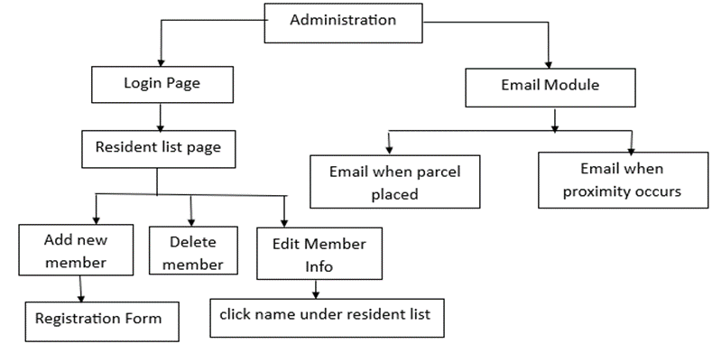
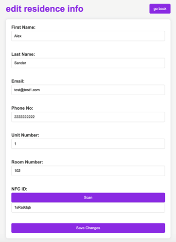

# smart parcel locker


The global parcel market has witnessed an unprecedented surge fuelled by the exponential growth of e-commerce. In response to this escalating demand, ensuring the security and convenience of parcel deliveries has become paramount. This surge, however, has also ushered in a concerning increase in parcel thefts, necessitating innovative solutions to safeguard deliveries. Introducing the Smart Parcel Locker System, a state-of-the-art solution designed to revolutionise package management in multi-unit dwellings. This system integrates cutting-edge technologies, including Raspberry Pi, NFC modules, magnetic sensors, OLED displays, and ultrasonic sensors, to create a secure and efficient parcel management ecosystem. Alongside these, the software suite, powered by a robust backend architecture, provides tracking, notifications, and analytics, ensuring seamless management of parcels. The NFC module ensures secure user authentication, allowing only authorised individuals to access the lockers. This System not only enhances the convenience of deliveries but also addresses the pressing issue of security in an era marked by increasing e-commerce activity. By providing secure storage, controlled access, and a robust software interface, it caters to the evolving needs of residents and couriers in modern urban environments. With its integration with a Raspberry Pi, the system boasts flexibility, scalability, and the potential for future enhancements. As the demand for reliable and secure parcel management solutions continues to surge, the Smart Parcel Locker System stands ready to redefine the future of package delivery.


### Prerequisites

1. Python 3.11
2. pip
3. virtualenv

### Installation Steps

#### Clone the repository

```bash
git clone https://github.com/Newguinea/parcel_locker.git
cd parcel_locker
```

#### Install Required Packages

Install the packages required for this project by running:

```bash
pip install -r requirements.txt
```

### Database Initialization
Before running the application, you need to initialize, migrate, and upgrade the database using Flask-Migrate. If you haven't set up Flask-Migrate, ensure it's installed by checking your requirements.txt or installing it directly with pip.

To set up the database, follow these steps:
```bash
flask db init
flask db migrate -m "Initial migration."
flask db upgrade

```

### change the API_KEY="this is the api key for mail gum" in .env file
maybe you need to sign up a mailgun account to get the api key.

These three commands will:

1. Initialize a new migration repository.
2. Autogenerate a new migration script, detailing the changes to be applied to the database.
3. Apply these changes to the database.

### Add administer to database
run add_user.py add a administer account to database. you can change the account name, email, password in the file.

```bash
python add_user.py
```

### Running the Application

To run the application, in the root of the folder execute:

```bash
python app.py
```

Visit `http://localhost:5000` in your web browser to view the application.

## Email module
the key of emailgun is in .env file, you can change it to your own key.

## Running the Tests

To ensure that the application is functioning as expected, a comprehensive suite of unit tests has been included. These tests cover everything from user authentication to CRUD operations for residences and API endpoints.

### Running Unit Tests

1. Navigate to the project root directory in your terminal.
2. Execute the following command to run the tests:

```shell
python -m unittest tests/tests.py
```
This command will search for all tests in the project and run them. Upon completion, a summary of the tests will be displayed, including any failures or errors.

It's recommended to run these tests frequently during development to catch any potential issues early on.

## Built With

* [Flask](http://flask.palletsprojects.com/) - The web framework used.
* [Flask-SQLAlchemy](https://flask-sqlalchemy.palletsprojects.com/) - An extension for Flask that simplifies database operations using SQLAlchemy.
* [Flask-Migrate](https://flask-migrate.readthedocs.io/) - An extension for Flask that handles SQLAlchemy database migrations for Flask applications using Alembic.
* [SQLite](https://www.sqlite.org/) - Lightweight database used for testing purposes.
* [unittest](https://docs.python.org/3/library/unittest.html) - The standard library for building and running tests in Python.

## INTRODUCTION AND BACKGROUND

### Fuelling Growth in Australia's Parcel Market

Australia's parcel market is expected to grow to more than 1 billion parcels a year by 2021. The parcel delivery market is seeing exponential growth, backed by the ease of shipping, delivery, and tracking parcels domestically and internationally. Australians receive an average of 34 parcels each year, driven by fast growth in e-commerce sales in 2017[1].

The surge in e-commerce activity within Australia has played a substantial role in bolstering the parcel shipping industry. Online marketplaces have set a high standard for customer experience, influencing consumer demands for convenience, competitive pricing, and a wide array of globally sourced products.

E-commerce is thriving globally, and Australia is no exception. With a population of 25 million, Australia stands as one of the prominent e-commerce markets. In 2020, it secured the 11th position in the world's largest e-commerce markets, experiencing robust growth. The onset of the COVID-19 pandemic is projected to boost e-commerce sales further, with a projected compound annual growth rate of 13.76% between 2022 and 2025.

As practices like social distancing, border closures, and lockdowns became routine, Australians turned to online platforms for their essential needs. The convenience offered by e-commerce, especially through home deliveries and Pick-Up Drop-Off (PUDO) networks, is anticipated to gain even more traction, expanding its reach to a broader audience and subsequently driving increased sales for retailers in the near future.

This surge in e-commerce deliveries has also given rise to express delivery services, such as same-day delivery, which has significantly augmented the Courier, Express, and Parcel (CEP) market in Australia. Consequently, Australia Post witnessed a surge in parcel revenue share from 36% to 39%, along with a parcel volume share increase from 37% to 40% in 2020.

### The Escalating Issue of Theft and Loss in Delivery Landscape

According to a recent survey conducted by Finder, out of 1,077 Australians polled, 21% reported experiencing the loss or theft of a parcel within the last year. This alarming statistic translates to an estimated 4.2 million parcels that have gone missing since April 2022. The research also highlighted that 5% of Australians have fallen victim to package theft from their residences after the delivery had taken place. This percentage equates to approximately 1.01 million parcels being pilfered on a national scale[2].

According to the first global report on parcel theft, doorstep parcel theft is sweeping Australia. More than 3.6 million parcels were lost or stolen in a 12-month period, with nearly a third of residents having a parcel stolen or lost. This has cost Australian consumers a total of AU$224.3 million in missing goods [3].

The results are part of the world’s first global parcel theft survey, which found that close to one in ten people had at least one parcel lost or stolen from May 2021 to April 2022. This amounts to a staggering 1.009 billion packages globally, at a total cost of AU$57.04 billion.[3]. Worldwide, there was an all-time high of stolen or lost parcels, with an estimated rise of 155 million compared to the previous 12 months, despite initiatives to tackle the surge post-COVID. This is more than a 2% increase [4].

Penn Elcom’s chairman, Roger Willems, said: “A surge in online shopping accelerated by Covid, along with seasonal rushes, means couriers are under intense pressure. Professional thieves are known to follow delivery vans, stealing packages minutes after they are dropped off, while opportunistic thieves take advantage of parcels left on doorsteps.”

“We expect parcel piracy to continue to rise as global parcel deliveries increase if measures are not taken. We are doing our best to support delivery companies and save online shoppers the headache of missed deliveries – as well as the heartache of lost and stolen parcels,” added Roger [5].

As per Google Trends data, there has been a significant surge in global searches related to 'parcel theft'. This spike corresponds to the ongoing trend of increased online shopping, particularly during seasonal holidays. Moreover, the study reveals that one in ten individuals worldwide now express hesitance towards online shopping due to concerns about theft, which is causing an impact on retailers.

Gavin Murphy, CMO of Scurri, said, “When parcel delivery fails at the final hurdle, the customer experience fails expectations and customers may be discouraged from buying online again from that retailer. Real-time data is critical. Simply stating that a package has been dispatched or is on board a last-mile delivery vehicle is totally inadequate.”

In 2019, 36% of respondents reported experiencing package theft, a number which increased to 43% in 2020. Among those who had a package stolen, a significant 64% stated they fell victim to this crime multiple times, 

Figure 1.


Figure 1: Comparison of Package Theft Incidents: 2019 vs. 2020. Source: [6]


Upon realising their package had been stolen, almost half (47%) took the step of filing a police report. The average cost of the pilfered package amounted to $136. Encouragingly, 81% shared that they were able to secure a refund for the stolen item(s).

As the tactics of package thieves, often referred to as "porch pirates," grow more sophisticated, consumers are recognising the importance of staying ahead in package theft prevention. Among the most prevalent strategies, doorbell cameras have emerged as a powerful deterrent. These unobtrusive cameras empower homeowners to monitor and vet visitors in real-time. Remarkably, 50% of respondents have adopted doorbell cameras, motion lights, or other forms of surveillance to safeguard against package theft.


Figure 2: Consumer Responses to Package Theft Concerns. Source:[6]

Despite the commendable efforts of delivery giants like FedEx, UPS, and Amazon Prime in implementing measures such as mandatory signatures and secure lock boxes, there remains a substantial 32% of consumers who believe that these companies should be taking even more robust steps in protecting deliveries. This sentiment highlights an ongoing need for continuous innovation and refinement in the realm of package security, Figure 2.

### A Journey Through Human Transport and Delivery

The act of transporting goods across regions has been a cornerstone of human development and cultural evolution. This historical narrative unfolds with vivid and captivating tales from every corner of the globe inhabited by humans.

Consider the ancient trade routes of North and East Africa, as well as the Mediterranean regions, dating back to the Neolithic period. These routes, illuminated by local wisdom and supported by the archaeological trace of obsidian, reveal the journeys of this volcanic rock spanning hundreds of miles from its origin to the hands of ancient peoples. Archaeologists diligently unearth and document these ancient trade routes, reconstructing the intricate networks through which items traversed [7].

Similarly, in East Africa and India, we uncover glass beads that bear witness to flourishing trade routes between these regions from the 7th to the 16th century AD. Through a blend of imagination and archaeological insights, we piece together the semblances of "delivery" and "transport" in these bygone eras.

As time marches forward, the prevalence of parcels in our collective imagination becomes a tapestry woven with colours, scents, and the mingling of diverse cultures. We conjure the legends of parcel delivery that continue to captivate students and shape our modern pop culture. In the annals of the Ptolemaic dynasty in Ancient Egypt, Cleopatra, amidst the turmoil of civil war, found herself in a precarious position, compelled to marry her brother. In a daring feat, she famously bundled herself within a carpet, evading her brother's armies to present herself at the feet of Caesar - a parcel of immense value indeed.

Crown jewels, national treasures, priceless artwork, and even concealed individuals have traversed borders, navigating realms of violence and corruption, at times vanishing into the annals of history. These parcels, some carrying immeasurable wealth and significance, encapsulate a singular journey from one place to another.

### Revolutionizing Delivery Security: The Smart Parcel Locker

In an age dominated by e-commerce, the retail landscape has undergone a profound transformation. However, with this shift, a pressing challenge has emerged - the escalating cases of parcel theft and loss, casting a shadow over the security of deliveries. The Smart Parcel Locker System emerges as a crucial solution.

A significant number of individuals have experienced the distressing loss or theft of parcels in recent times. This troubling trend not only leads to substantial financial repercussions but also shakes the trust and assurance of consumers in their online shopping experiences. The Smart Parcel Locker System addresses this concern by providing a secure and dependable storage avenue for deliveries, instilling confidence in both residents and couriers.

The ease of online shopping is indisputable, but it's now imperative to fuse this convenience with robust security measures. The Smart Parcel Locker System embodies this philosophy, seamlessly integrating cutting-edge technologies to guarantee the safekeeping of deliveries. In doing so, it not only safeguards the interests of consumers but also fortifies the reputation of retailers as dependable and trustworthy providers of goods and services.

The delivery experience stands as a pivotal factor for retailers in a competitive market. As consumers increasingly prioritise seamless and secure delivery options, the Smart Parcel Locker System emerges as a strategic investment for businesses aiming to enhance their service offerings. This innovative solution not only augments convenience for customers but also positions retailers as trailblazers in prioritising customer satisfaction and security.

Within the logistics realm, the "last mile" has long been recognised as a critical juncture for ensuring successful deliveries. The Smart Parcel Locker System represents a forward-looking strategy to tackle the challenges of this crucial phase. By furnishing a technologically advanced, secure, and easily accessible parcel storage solution, it not only streamlines the last mile but also future proofs it against the evolving landscape of consumer expectations and delivery demands.

The rise of online shopping and food delivery services has amplified the need for secure and convenient storage solutions in apartment complexes. Many residents grapple with the safety of their delivered items when they are not present to receive them. This report introduces the concept of a Smart Parcel Locker System, poised to revolutionise the way packages and food deliveries are managed in multi-unit dwellings.

#### Market Demand

The surge in online shopping and food delivery services has created a heightened demand for secure storage options within apartment complexes. Residents' lifestyles often conflict with traditional delivery schedules, prompting the need for a reliable and accessible storage solution. The Smart Parcel Locker System seeks to address this demand, offering couriers a secure deposit space and residents a convenient retrieval method.

#### Convenience, Security, and Efficiency

This innovative system not only enhances the convenience of residents by providing a reliable storage option but also addresses the escalating concerns of package theft and security. By introducing a multi-compartment locker system, both residents and couriers gain peace of mind, knowing that their items are safeguarded. Furthermore, the Smart Parcel Locker streamlines the delivery process, optimising the efficiency of courier services.

### Project Objectives

The Smart Parcel Locker System, subject to evaluation in this project, encompasses a range of functionalities, including secure compartment management, real-time notifications, and user-friendly interfaces for residents and couriers. This prototype was developed in consideration of the unique challenges and demands of modern urban living, aiming to offer a seamless and secure delivery experience.

In the following sections, we will delve into the methodology, hardware requirements, and the expected impact of implementing the Smart Parcel Locker System in apartment complexes. By doing so, we endeavour to present a comprehensive solution to the evolving needs of residents and couriers alike.

## DEPLOYMENT AND IMPLEMENTATION

### Hardware Deployment

The Smart Parcel Locker System stands as an integrated solution meticulously designed to augment the security and convenience of parcel management within multi-unit residential complexes. Orchestrated by a Raspberry Pi at its core, this system seamlessly manages the entire lifecycle of parcels, from their reception to retrieval.

As shown in Figure 3, A strategically positioned magnetic sensor diligently monitors the status of the locker door. When a parcel finds its way inside and the door seals shut, this astute sensor promptly communicates with the Raspberry Pi, signifying the locker's readiness for secure storage. The camera module, a vigilant sentry, captures visual records outside the locker, elevating the system's security posture. Each parcel's entry is meticulously documented, generating a visual archive of received items. The relay module, deftly controlled by the Raspberry Pi, oversees the solenoid lock. Upon detection of a valid parcel, the Raspberry Pi deftly triggers the relay, empowering the solenoid lock to fortify the locker. This intricate maneuverer ensures that only authorised personnel can retrieve the stored parcels. To retrieve a parcel, a user undergoes a swift and secure authentication process, often facilitated through an NFC card or a PIN code. The Raspberry Pi, once satisfied with this authentication, graciously unlocks the treasure trove, permitting access to the parcel within.


Figure 3: Working flow diagram

In concert with the Raspberry Pi's directives, an OLED display, integrated seamlessly into the locker, imparts real-time feedback to users. Its functions range from signalling locker availability to dispensing essential usage instructions or delivery status updates. Notably, the Camera Module and Ultrasonic Sensor are strategically positioned outside the locker to enhance security and monitoring. This strategic placement allows for efficient tracking of parcel delivery and collection, ensuring a comprehensive view of activity.
#### Hardware Implementation and Configurations
At the heart of the Smart Parcel Locker System lies the Raspberry Pi, functioning as the central command unit, both powered and internet-connected for seamless communication. This versatile hub orchestrates the entire operation. The NFC Module (PN532) securely interfaces with the Raspberry Pi via GPIO pins, allowing access through NFC cards or compatible devices. The Magnetometer (QMC6310) adds an extra layer of security, communicating through the I2C interface to detect any unauthorized access or tampering attempts. An intuitive OLED Display (PiicoDev OLED Display Module SSD1306) communicates effortlessly with the Raspberry Pi through the I2C interface, providing users with a clear visual interface. 
The Relay Module and Solenoid Lock (FL-3FF-S-Z) manage secure access control. The relay module, linked to the Raspberry Pi's GPIO pins, acts as the switch to control the solenoid lock, which operates on a separate 12V power source, ensuring only authorised users retrieve parcels. A Camera Module, integrated into the Raspberry Pi's camera port facilitates image capture and processing for enhanced security measures. The Numeric Keypad, connected to the Raspberry Pi via GPIO pins, adds an extra layer of user authentication through PIN-based access. Externally, the Ultrasonic Sensor (RCWL-1601), interfaced with the Raspberry Pi via GPIO pins, acts as a vigilant guardian, detecting motion around the parcel box, further fortifying security. Power distribution is streamlined, with the Raspberry Pi, NFC module, magnetometer, OLED display, relay module, and numeric keypad drawing power through the GPIO pins. These deliver both 3.3V and 5V outputs, while the solenoid lock and camera module rely on a dedicated power source with meticulous voltage regulation. Figure 4 shows the whole circuit diagram of the system.


Figure 4: Circuit diagram of smart parcel locker

#### Sensors and Main Components

##### • Raspberry Pi

The choice of the Raspberry Pi as the project's microcontroller and communication hub was driven by its extensive documentation, robust library support, and expansive ecosystem of compatible integrations. This decision was made to ensure adaptability in addressing various challenges and achieving optimal system performance. However, it's worth noting that this choice comes with a slight trade-off in terms of increased cost and physical size compared to more specialised microcontrollers.
 
An Expander Pi module from AB Electronics was integrated to augment the capabilities of the Raspberry Pi. This addition facilitates seamless access to the three analogy photocells through the MCP3208 ADC converter. Additionally, digital I/O pins were strategically employed to create a compact yet effective LED-based status monitoring circuit. The versatility of this setup empowers the project to tackle a diverse range of scenarios, ensuring adaptability in current and prospective applications. The Raspberry Pi's rich library ecosystem and well-documented resources significantly expedited the development process. Leveraging these readily available resources not only streamlined the implementation but also allowed for a more robust and sophisticated solution.

##### • NFC Module (PN532):

The NFC (Near Field Communication) module is a vital component within the Smart Parcel Locker System, serving multiple essential functions. It stands as a secure authentication tool, allowing authorised users to access the locker with a simple tap of their NFC card or device. This streamlined process eliminates the need for physical keys or entry codes, enhancing user convenience and efficiency. Moreover, the NFC module seamlessly integrates into the Internet of Things (IoT) ecosystem of the system, effectively communicating with the Raspberry Pi microcontroller for user verification. It also offers extensive customisation options, enabling administrators to manage user permissions and track parcel retrievals. Depending on the specific NFC module utilised, advanced security features like encryption and authentication protocols can be implemented, further fortifying the system against unauthorised access. Additionally, the widespread support for NFC technology in modern smartphones and mobile devices extends its convenience, allowing users to utilise their devices as NFC credentials. This comprehensive integration of the NFC module enhances the overall security, convenience, and efficiency of the Smart Parcel Locker System, ensuring that parcels are retrieved solely by authorised individuals.

##### • Magnetometer (QMC6310):

The inclusion of the QMC6310 magnetometer in the Smart Parcel Locker System is pivotal for several reasons. Firstly, its high sensitivity to magnetic fields significantly enhances security. This sensitivity allows it to promptly detect any irregular or unauthorised attempts to tamper with the locker, acting as a robust deterrent against potential theft or tampering. Additionally, the QMC6310 serves as a vital tamper-proofing mechanism, ensuring that any unauthorised manipulation of the locker is immediately identified. While other authentication methods like NFC cards and PIN codes are effective, they may still have vulnerabilities. The QMC6310 provides an additional layer of non-invasive yet highly effective security by detecting any magnetic interference. This redundancy in security measures substantially reinforces the overall system. Moreover, the QMC6310's capability to detect both static and dynamic magnetic fields means it can identify changes caused by attempts to manipulate the locker's locking mechanism. This versatility further solidifies its role in enhancing security within the Smart Parcel Locker System, making it an indispensable component for safeguarding parcels.

##### • OLED (PiicoDev OLED Display Module (128x64) SSD1306): 

OLED displays are known for their exceptional visual quality, providing clear and vibrant images along with high contrast ratios. This ensures that information displayed on the screen is easily readable and discernible, even in varying lighting conditions. OLED technology offers flexibility in terms of screen size, allowing for a compact yet informative display. This is particularly advantageous for the Smart Parcel Locker, where space may be limited, but the need for conveying crucial information is paramount. Additionally, OLED displays are known for their energy efficiency. They only consume power when pixels are active, making them an economical choice for displaying static or intermittently changing information, aligning well with the intermittent usage patterns of a parcel locker. Furthermore, OLED screens provide a wide viewing angle, ensuring that users can easily interact with the locker from various positions and angles. OLED displays are compatible with Raspberry Pi, making the integration process seamless. The availability of libraries and resources for interfacing OLED screens with Raspberry Pi further streamlines the development process. In essence, the choice of an OLED display in the Smart Parcel Locker System is driven by its superior visual quality, energy efficiency, compatibility with Raspberry Pi, and suitability for space-constrained environments, all of which contribute to an enhanced user experience.

##### • Relay Module (FL-3FF-S-Z is a standard 5VDC relay) and Solenoid lock: 

The Relay Module and Solenoid Lock were selected for their seamless compatibility with the Raspberry Pi microcontroller, ensuring efficient control over the locker's security. The relay module acts as a vital intermediary, allowing the low-voltage Raspberry Pi to manage the higher-voltage solenoid lock effectively. This dynamic ensures the locker remains securely locked until authorised access is granted.
 
The solenoid lock, known for its robustness and reliability in security applications, operates by electromagnetically controlling the locking mechanism. This feature makes it a sturdy and durable choice, aligning perfectly with the project's security objectives. Its wide use in various security systems attests to its effectiveness in safeguarding valuable items. Furthermore, the solenoid lock's compatibility with the relay module streamlines the integration process. Together, they form a dependable locking mechanism for the parcel locker, guaranteeing that only authorised individuals can access the stored items.

##### • Camera Module: 

The PiCamera is a purpose-built module designed to seamlessly integrate with Raspberry Pi, ensuring compatibility and smooth operation within the system. Its compact form factor and low power consumption make it an ideal choice for embedded applications. It offers high-resolution imaging capabilities, enabling detailed and precise capture of parcels and their surroundings. This high-quality visual data is crucial for security and verification purposes, providing a reliable record of received items. The PiCamera's programmable interface allows for flexibility in capturing images, enabling features like motion detection or specific event-triggered photography. This versatility enhances the functionality and security of the Smart Parcel Locker System. Furthermore, the availability of comprehensive documentation, libraries, and a thriving community around the PiCamera simplifies development and troubleshooting, ensuring a smoother integration process.

##### • Numeric Keypad:

The 3*4 Numeric Keypad was incorporated into the project to provide a convenient and secure means of user authentication. Its compact design and straightforward interface allow users to input their designated credentials, such as a PIN code, ensuring that only authorised individuals can access the stored parcels. This keypad's layout offers a balance between simplicity and functionality, making it easy for users to interact with the system. Additionally, its cost-effectiveness and compatibility with the Raspberry Pi make it a practical choice for enhancing the security of the Smart Parcel Locker. By integrating the 3*4 Numeric Keypad, the project ensures a user-friendly and reliable authentication process, further fortifying the locker's security features.

##### • Ultrasonic sensor (RCWL-1601)

The Ultrasonic sensor, specifically the RCWL-1601 model, was chosen for its excellent motion detection capabilities. Placed outside the parcel box, its purpose is to monitor any activity near the box, acting as an additional layer of security against potential theft. This sensor operates on Doppler radar technology, allowing it to detect both living and non-living objects accurately. Its adjustable sensitivity and time-delay settings provide customisation options to suit the specific needs of the project. Additionally, the RCWL-1601's ability to penetrate certain materials and its more extended detection range make it a reliable choice for this security application. By employing this ultrasonic sensor, the project aims to enhance the safety and security of stored parcels.

##### • Power Supply

In a household setting, a stable power supply is typically assured for the Smart Parcel Locker System. However, optimising power usage remains a crucial consideration for efficiency and cost-effectiveness.
 
The core components in this system are engineered for low power consumption. The NFC Module, Magnetometer, OLED display, Relay Module, Camera Module, Numeric Keypad, and Ultrasonic Sensor all operate efficiently within the specified voltage range. Of these, the Raspberry Pi is the most power-intensive component, but its selection is justified by the extensive development environment it provides, ensuring versatility and robust performance.

By strategically utilising the available 3.3V and 5V pins on the Raspberry Pi, along with external power supplies where necessary, the Smart Parcel Locker System optimises power distribution to meet the distinct voltage requirements of its integrated components. This approach not only ensures reliable functionality but also minimises the risk of voltage-related issues.

### Software Architecture

#### Overview

The Smart Parcel Locker system integrates hardware and software components seamlessly. Using Raspberry Pi as the central hub, the system is designed to optimise IoT functionalities, efficiently manage resident data, and provide real-time notifications. The software architecture is shown in Figure 5. Figure 6 shows the flow chart of how the system run.


Figure 5:  Software Architecture

Figure 6: Software working flow diagram.

#### Flask Web Application

The central interface is exclusively designed for administrators, ensuring they have a secure and dedicated portal for their operations. Its primary purpose is to provide a robust environment where authorised administrators can manage resident data with ease.

Figure 7: Admin Login Page in Flask App

Here is a login page for admin login (shown in Figure 7). Before that, the admin’s username and password can be added with add_user.py by changing the account name, email, and password in the file (shown in Appendix A). At the heart of this system is the "Resident Management" feature (shown in Figure 8), which is displayed after login successfully. Here, administrators can dive into a comprehensive list that showcases residents, their respective room numbers, and email addresses. This detailed list not only offers a bird's eye view of all the residents but also empowers admins with management capabilities. The administrator can go to the profile page by clicking the name to modify the resident information (shown in Figure 9). They can effortlessly delete resident entries with the Delete button or add new ones with the help of the "Register New Residents" button. This button directs them to a specially designed form that ensures seamless registration of new residents.

Figure 8: Resident List Page in Flask App

Figure 9: Edit Residence Info Page in Flask App

When it comes to registering new residents, the system features an "Add New Residence Form" (as illustrated in Figure 10). This detailed form is designed to capture all essential details about a resident. From basic information such as first and last names, email, and phone numbers to more granular data like unit number, room number, and a distinct NFC ID, everything is arranged for accurate data input. By swiping an NFC card on the NFC module, the system will automatically generate the corresponding NFC ID. The "Create" button ensures a smooth conclusion to the registration process, guaranteeing a hiccup-free experience.


Beyond these functionalities, the system demonstrates its technological prowess by integrating with Raspberry Pi. This integration is pivotal for capturing real-time data, especially when it comes to locker statuses. Even though the parcel box status view is not displayed on the provided pages, this integration guarantees that the admin panel remains updated, facilitating efficient parcel management.
In summary, these interfaces are a testament to administrative efficiency. They encompass a range of functionalities, from registering and updating resident details to monitoring parcel box statuses and managing delivery notifications and alerts. The system ensures that administrators have a comprehensive toolkit at their disposal.

#### Raspberry Pi Application

The Raspberry Pi stands as a cornerstone of the system, undertaking pivotal roles that bridge the gap between intricate hardware components and the intuitive Flask application. Its presence ensures that every interaction and process run smoothly, epitomising the perfect blend of technology and user-friendliness.

One of the Raspberry Pi's prime functionalities is its integration with the NFC Reader. Imagine a scenario where residents are registering, they scan their NFC card, and voilà, the NFC ID is immediately registered. This effortless mechanism offers a dual advantage – while residents find a hassle-free registration process, they also have an expedited method of identity verification when they come to collect their parcels. The simple act of placing the NFC card near the reader ensures that parcels are handed over only to their rightful owners, thereby enhancing both efficiency and security.

Complementing the NFC Reader is the Pin Pad, a versatile tool that comes into play during parcel pick-up processes. At times, residents might be in situations where their NFC card is not accessible or perhaps it's malfunctioning. This is where the pin pad proves its worth. Residents can input their registered mobile phone number, providing an alternate means of verification. However, the pin pad's utility does not end here. Each time a parcel finds its way into the locker, a unique pickup code is generated. Residents, when coming to collect their parcel, need to input this specific code. This meticulous design ensures an additional layer of security, making sure that only individuals equipped with the correct code can get their hands on the parcel.

To top it all off, the entire system gets its dynamism from the Flask application that runs locally on the Raspberry Pi. This ensures that every action, every scan, and every input is reflected in real-time, paving the way for synchronised operations. An enhanced user experience that resonates with technological sophistication and convenience.

#### Email Module

The Email module (Figure 11), executed with Python and the Mailgun API, has been meticulously crafted to bolster package delivery transparency and efficiency. Its primary role is to offer immediate notifications to package beneficiaries, ensuring prompt and effective package collection. Utilizing the Simple Mail Transfer Protocol in conjunction with the Mailgun API, the system assures secure and rapid email dispatches. For enhanced security measures, API keys are securely stored through the dotenv module, mitigating the vulnerabilities of embedding sensitive information directly in the code. The module effortlessly integrates with an SQLite database, allowing it to retrieve recipient information and keep a detailed record of package deliveries. 

This not only provides chronological documentation of all deliveries but also guarantees that beneficiaries receive the necessary alerts (Figure 12). We use an ultrasonic sensor for human detection. When someone is picking up a package, if they stay in front of the delivery locker for more than 5 seconds, the PiCamera will take a photo and send an email to the recipient of the package.

Uniform email communications are facilitated through a predefined template that shares vital details, such as the beneficiary's name, a distinct 4-digit pickup code, and the package's timestamp of arrival. The system's efficiency is underscored by its capability to recognise incoming packages, after which it pulls the beneficiary's data from the database using their email address and kickstarts the email alert process. For each package, a randomised 4-digit pickup code is produced to reinforce security, ensuring that packages are handed over exclusively to the designated beneficiaries. Furthermore, the module boasts sophisticated error-management mechanisms to tackle potential obstacles, be it database mismatches, email dispatch complications, or scenarios where beneficiary data might be missing, guaranteeing an uninterrupted, robust operational trajectory.


Figure 11: Notification to package beneficiaries


Figure 12: Alert to package beneficiaries

#### Database & Data Management

The primary objective of this section is to provide a robust mechanism for storing, retrieving, and managing resident data. We have opted for the SQLite Database due to its lightweight operational capabilities and seamless integration with Flask. SQLite offers developers an efficient and user-friendly database solution without the need for intricate configurations. In terms of data model details:

The User Model encompasses attributes such as username, email, encrypted password_hash, and the user's active status (is_active), ensuring each user's data remains secure and easily manageable.

The Residence Model captures essential resident details, including first_name, last_name, email, contact number (phone_no), unit designation (unit_num), room number (room_no), and a unique NFC ID (nfc_id) for authentication.

The Log Model is geared towards tracking and documenting various activities, incorporating elements like NFC ID (nfc_id), access code (code), the precise timestamp (timestamp), and the event status (is_taken), giving administrators real-time insights into system activities.

Furthermore, to maintain data integrity and accuracy, a comprehensive set of CRUD operations is in place, facilitating the creation, reading, updating, and deletion of data records.


## RESULTS AND TESTING

### Automated Testing for Residence Management System

The testing phase of the Residence Management System sought to ensure that all functionalities, especially those pertaining to user authentication, residence management (creation, deletion, editing), and data retrieval, were executed accurately and securely. The tests were designed to cover all major operations that administrators would perform, as well as key API functionalities.

#### Objectives of Testing

**Ensure Robustness and Reliability:** The primary objective of these tests is to ensure that the application is robust and can handle various scenarios without failure.

**Validate Functionalities:** Each test targets specific functionalities of the application to validate that they are working as expected.

**Detect Regression:** These tests help in the early detection of any regression caused by newly added features or changes to existing features.

**Authenticate Authorisation:** Some tests ensure that the application routes and features are only accessible to authenticated users.

#### Test Overview
Table 1: Test items with test.py

| Category                  | Test Description                                          | Test Name                           |
|---------------------------|----------------------------------------------------------|-------------------------------------|
| Routes Testing            |                                                          |                                     |
| Setup & Teardown          | Fresh SQLite database setup and destroy for test isolation.|                                    |
| Login & Logout Routes     | Ensure successful login.                                 | test_login                          |
|                           | Ensure successful logout.                                | test_logout                         |
| Residence Management      | Validates the creation of a new residence.               | test_create_residence               |
|                           | Ensures successful residence deletion.                   | test_delete_residence               |
|                           | Tests the edit functionality for residences.             | test_edit_residence                 |
| API Testing               |                                                          |                                     |
| Fetching Residence Details| Retrieves details of a specific residence.               | test_get_residence                  |
|                           | Ensures multiple residences are listed correctly.        | test_residence_list_data            |
| NFCID Retrieval           | Check if NFCID can be retrieved successfully.            | test_getNFCID_success               |
|                           | Tests application's response to NFCID value "00000000". | test_getNFCID_error (1st scenario)  |
|                           | Tests application's response to no NFCID value (None).   | test_getNFCID_error (2nd scenario)  |

#### Outcomes

The automated testing covered key functionalities of the system. The login and logout processes were effectively verified, confirming that users can securely access and exit the system using valid credentials. The system's capabilities in managing residences, including operations like creation, deletion, and modification, were thoroughly validated. Additionally, the functionality to fetch residence details, both for individual and multiple entries, was successfully tested. Notably, the NFCID retrieval function was rigorously examined under both successful and error-prone scenarios, reinforcing the system's robustness.


### Manual Test for System Integration
There are some tests for system integration (Table2)

| Test Number | Test Description                               | Purpose                                                        | Steps                                                                                                                                                        | Expected Result                                                           | Result |
|-------------|------------------------------------------------|----------------------------------------------------------------|--------------------------------------------------------------------------------------------------------------------------------------------------------------|---------------------------------------------------------------------------|--------|
| 1           | NFC Card Reading                               | To verify the system reads NFC card data.                       | 1. Place the NFC card on the reader.<br>2. Observe if the system displays related card data or identification.                                               | The system successfully reads and displays NFC card data.                 | Pass   |
| 2           | Sending Pickup Email                           | Ensure the system sends a notification to the package recipient. | 1. Simulate a new package arrival event in the system.<br>2. Check the recipient's email for pickup notification.                                          | The recipient's email should have a new pickup notification.              | Pass   |
| 3           | Successful Pickup using NFC                    | Verify pickup success with an NFC card.                         | 1. Place the NFC card on the reader.<br>2. Confirm if the system releases the package or provides pickup confirmation.                                      | The package should be successfully released to the NFC card user.         | Pass   |
| 4           | Successful Pickup using 4-digit Code           | Ensure pickup success using a 4-digit code.                     | 1. Enter the received 4-digit code in the system.<br>2. Confirm if the system releases the package or provides pickup confirmation.                          | The package should be successfully released to the user entering the 4-digit code. | Pass   |
| 5           | Successful Pickup using Phone Number           | Verify pickup success with phone number.                        | 1. Enter the intended recipient's phone number in the system.<br>2. Confirm if the system releases the package or provides pickup confirmation.             | The package should be successfully released to the user entering the phone number. | Pass   |
| 6           | Sending Warning Email due to Sensor Detection  | Ensure the system sends a warning email if someone stands in front of the sensor for over 5 seconds. | 1. Stand in front of the sensor for over 5 seconds.<br>2. The system should capture a photo.<br>3. Check the recipient's email for the warning email with the captured photo. | The recipient's email should have a new warning email with the captured photo. | Pass   |
| 7           | Incorrect Phone Number Entry                   | Test system behaviour with incorrect phone number.              | 1. Enter an incorrect phone number in the system.<br>2. Try to retrieve a package.                                                                         | The system should display an error message and not release the package.   | Pass   |
| 8           | Incorrect 4-digit Code Entry                   | Test system behaviour with incorrect 4-digit code.              | 1. Enter an incorrect 4-digit code in the system.<br>2. Try to retrieve a package.                                                                         | The system should display an error message and not release the package.   | Pass   |


## Conclusion

The project aims to address contemporary societal challenges associated with package deliveries. On the hardware front, it employs an ultrasonic sensor for detection and integrates a PiCamera for monitoring. For enhanced security, a solenoid lock is used, ensuring only authorized access. The system also features a user-friendly keypad for manual input and incorporates NFC technology, allowing residents to conveniently retrieve their parcels using NFC cards. On the software side, the architecture is built on the Flask framework and offers a range of modules, from user registration and authentication to sending email alerts. The primary impact and advantage of this initiative are to guarantee the security of parcel deliveries. Furthermore, it presents a scalable solution for secure and efficient package management, especially in densely populated urban areas.

## Recommendations and Future Work

To fortify the security of the Smart Parcel Locker System and enhance its functionality, several key recommendations and avenues for future development have been identified. Firstly, incorporating tamper-evident seals and advanced locking mechanisms on individual compartments can add an extra layer of security. Additionally, the integration of a video surveillance system with motion detection capabilities can serve as a crucial deterrent and investigative tool for security incidents. Exploring biometric authentication methods like fingerprint or facial recognition offers a prominent level of security and convenience for user access.

Ensuring a robust and tamper-resistant physical design of the locker itself is imperative. Employing secure communication protocols, such as SSL/TLS, is vital for encrypting data exchanges between the locker system and external devices. Educating users on identifying and avoiding phishing attempts, particularly in relation to email notifications, is also crucial.

Looking ahead, potential avenues for future work encompass a broad spectrum of enhancements. These include the integration of artificial intelligence algorithms for anomaly detection in user behaviour, and the implementation of geofencing technology to restrict locker access based on a user's physical location. The exploration of blockchain for secure parcel tracking and the development of intelligent locking mechanisms with remote control capabilities are also promising.

Establishing a clear incident response protocol in case of a security breach and conducting regular security audits and penetration testing to identify vulnerabilities are essential practices. Staying updated on evolving data protection and privacy regulations ensures ongoing compliance with industry standards. Lastly, providing continuous user education on security best practices will further enhance the overall security of the system.

In addition to security measures, there are recommendations for functionality and user experience improvements. Integrating a user feedback system can gather valuable insights for system enhancements. Options for remote monitoring and control through a mobile app or web interface could enhance user convenience. Advanced security measures like facial recognition, fingerprint scanning, or two-factor authentication should be investigated to bolster access control further.

Furthermore, considering compatibility with popular home automation platforms such as Google Home or Amazon Alexa could broaden the system's integration possibilities within smart home environments. Incorporating a battery backup system will ensure uninterrupted service during power outages.

In terms of future work, implementing machine learning algorithms for anomaly detection can significantly enhance security by identifying unusual patterns or suspicious behaviour around the locker. Predictive analytics based on historical data can be used to anticipate peak parcel delivery times, enabling users to plan their visits more efficiently. Integrating GPS or location-based services will allow users to quickly locate the nearest available locker and provide real-time delivery tracking. Weather data integration can offer users relevant information, such as options for protecting parcels during adverse weather conditions.

Providing customisation options for users to adjust locker settings, including notification preferences, language preferences, or display themes, would add a personalised touch to the system. Additionally, exploring integration possibilities with delivery services and courier companies can streamline the process for both users and delivery personnel. Finally, optimising energy efficiency through power-saving techniques and potentially utilising renewable energy sources should be considered to minimise environmental impact. All these recommendations and future work ideas should be evaluated in alignment with the resources and target audience preferences. Conducting market research or user surveys can provide valuable insights into prioritising these enhancements.

##	REFERENCES
	
[1]	Research, ‘Australian courier, Express and Parcel (CEP) Market report 2021 - expected to grow to more than 1 billion parcels a year from 2021’, Research and Markets, 22-Jan-2021. [Online]. Available: https://www.globenewswire.com/news-release/2021/01/22/2162875/0/en/Australian-Courier-Express-and-Parcel-CEP-Market-Report-2021-Expected-to-Grow-to-More-Than-1-Billion-Parcels-a-Year-From-2021.html. [Accessed: 9-Oct-2023].

[2]	N. Kwiet-Evans, ‘Mail fail: 4.2 million parcels have gone missing in the past year’, finder.com.au, 17-May-2023. [Online]. Available: https://www.finder.com.au/missing-parcels-2023. [Accessed: 9-Oct-2023].

[3]	‘Australian parcel theft rockets to an all-time high with the second largest rise than any other country globally’, Australian Associated Press. [Online]. Available: https://www.aap.com.au/aapreleases/cision20221016ae01885/. [Accessed: 10-Oct-2023].

[4]	Parcelandpostaltechnologyinternational.com. [Online]. Available: https://www.parcelandpostaltechnologyinternational.com/news/delivery/report-finds-global-parcel-theft-on-the-rise-with-uk-the-worst-affected-market.html. [Accessed: 10-Oct-2023].

[5]	Modern Retail, ‘UK parcel theft rockets to an all-time high’, Modern Retail, 19-Oct-2022. [Accessed: 10-Oct-2023].

[6]	A. Tuazon, ‘2020 Package Theft Statistics Report’, Market Research Chicago | Market Research Companies | C+R, 19-Dec-2020. [Online]. Available: https://www.crresearch.com/blog/2020-package-theft-statistics-report/. [Accessed: 10-Oct-2023].

[7]	‘A brief history of parcel lockers’, Smiota, 07-Feb-2022. [Online]. Available: https://smiota.com/resources/a-brief-history-of-parcel-lockers. [Accessed: 10-Oct-2023].

## Appendices

Appendix A: Code with documentation

The source code for Smart Parcel Locker can be found at https://github.com/Newguinea/parcel_locker

This code also provides comments and explanations about the functionality of each file, class, and method.

The source code is organised under the app directory.

**email_module directory:** contains the HTTP requests sending emails and email templates.

**tests directory:** contains code for testing each sensor individually.

**PiLocker.py:** contains all sensor initialisation code and basic debugging returns.

**PN532_UART.py:** contains the driver library used by PN532 (the card reader).

**static directory:** contains CSS, JavaScript and images required for the user interface.

**CSS directory:** Contains the style.css file with the CSS styles for the user interface.

**hardware_connection directory:** contains some basic APIs connecting hardware and software. 
